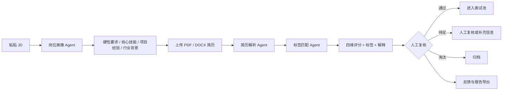

# AI 简历筛选系统

<p align="center">
  <strong>面向 HR 的本地化、可解释、人工复核型 AI 招聘工作台</strong>
</p>

<p align="center">
  将岗位描述转化为结构化岗位画像，批量解析简历，输出可解释的多维匹配结果，帮助招聘人员更快完成初筛，同时保留最终决策权。
</p>

<p align="center">
  <a href="https://github.com/Banna-skech/ai-resume-screening-system"></a>
  <a href="https://streamlit.io/"></a>
  <a href="https://api-docs.deepseek.com/"></a>
  <a href="https://github.com/Banna-skech/ai-resume-screening-system/stargazers"></a>
  <a href="https://github.com/Banna-skech/ai-resume-screening-system/issues"></a>
</p>

> **项目状态**：可运行的单用户本地工具。适合个人 HR 工作流、内部原型和招聘流程验证；尚未定位为多用户生产级 ATS。

## 目录

- [为什么做这个项目](#为什么做这个项目)
- [核心能力](#核心能力)
- [工作流](#工作流)
- [评分与决策机制](#评分与决策机制)
- [技术架构](#技术架构)
- [快速开始](#快速开始)
- [使用指南](#使用指南)
- [配置说明](#配置说明)
- [性能设计](#性能设计)
- [安全与隐私](#安全与隐私)
- [项目结构](#项目结构)
- [已知限制](#已知限制)
- [路线图](#路线图)
- [贡献指南](#贡献指南)

## 为什么做这个项目

传统的关键词筛选容易漏掉同义表达，也很难解释“为什么这个候选人通过、另一个候选人被淘汰”。纯粹依赖大模型又容易出现标准漂移、结论不可复核和成本不可控的问题。

本项目采用“结构化岗位画像 + 文档解析 + 多维度匹配 + 人工复核”的组合方式：

- **让岗位标准先结构化**：把 JD 拆成硬性要求、核心技能、项目经验和行业背景。
- **让评分可以解释**：按技能、经验、背景、意向分别评分，并生成证据导向的评语。
- **让批处理可控**：一次上传多份简历，逐份反馈状态，单个文件失败不会中断整批任务。
- **让 AI 保持在副驾驶位置**：系统负责提速和提供依据，最终判断仍由招聘人员完成。

## 核心能力

| 能力 | 说明 | 当前状态 |
| --- | --- | --- |
| 岗位画像生成 | 从 JD 生成结构化岗位画像，可人工编辑和保存为模板 | ✅ 已实现 |
| 多格式解析 | 支持 PDF、DOCX 简历文本提取与清洗 | ✅ 已实现 |
| 多维匹配评分 | 技能、经验、背景、意向四个维度加权评分 | ✅ 已实现 |
| 批量筛选 | 批量处理简历，提供实时进度和单文件错误反馈 | ✅ 已实现 |
| 可解释结果 | 展示维度评分、标签、命中项、缺失项和 LLM 评语 | ✅ 已实现 |
| 人工反馈闭环 | 标记“实际合格 / 实际不合格”，记录反馈数据 | ✅ 已实现 |
| 报告导出 | 导出 Excel 与 JSON 结果 | ✅ 已实现 |
| 扫描件 OCR | 对图片型 PDF 做 OCR 识别 | 🧭 规划中 |
| 多用户与权限 | 团队协作、角色权限和审计日志 | 🧭 规划中 |

## 工作流



在应用中对应五个页面：

1. **首页工作台**：查看已处理、通过率、待审和淘汰等关键指标。
2. **岗位画像**：生成、编辑、保存和选用岗位模板。
3. **简历筛选**：选择岗位画像，批量上传简历并运行筛选。
4. **筛选结果**：按决策、最低分、姓名过滤和排序，查看候选人详情。
5. **系统设置**：管理 DeepSeek API、评分阈值和维度权重。

## 评分与决策机制

### 默认决策阈值

| 综合分数 | 决策 | 含义 |
| ---: | --- | --- |
| `≥ 70` | ✅ 通过 | 进入面试池或下一轮评估 |
| `50–69` | ⚠️ 待定 | 建议人工复核，补充证据后再决定 |
| `< 50` | ❌ 淘汰 | 初筛阶段不建议继续推进 |

### 默认维度权重

| 维度 | 权重 | 关注点 |
| --- | ---: | --- |
| 技能匹配 | 35% | 核心技能是否出现、熟练度和相关性 |
| 经验匹配 | 30% | 年限、职责、项目深度和岗位相关性 |
| 背景匹配 | 20% | 行业、公司背景、教育与项目环境 |
| 意向匹配 | 15% | 薪资、地点、到岗时间和职业方向 |

硬性要求未满足时会触发扣分；当未满足项达到规则上限时，系统会强制降低决策等级。所有阈值和权重都可以在“系统设置”中调整，调整后的配置只影响后续筛选任务。

> **重要边界**：分数是筛选辅助信号，不是录用结论。招聘人员应结合原始简历、面试表现、业务需求和合规要求做最终判断。

## 技术架构

```text
┌──────────────────────────────────────────────────────────┐
│ Streamlit UI                                             │
│ 首页 · 岗位画像 · 简历筛选 · 筛选结果 · 系统设置          │
└──────────────────────────┬───────────────────────────────┘
                           │
┌──────────────────────────▼───────────────────────────────┐
│ Pipeline Orchestrator                                    │
│ 单份简历处理链 · 批量处理 · 进度回调 · 错误隔离            │
└───────────────┬───────────────────────────┬──────────────┘
                │                           │
┌───────────────▼──────────────┐  ┌────────▼────────────────┐
│ Agents                       │  │ Services                 │
│ 岗位画像 · 简历解析 · 标签匹配 │  │ 文档解析 · 模板管理 · 报告 │
└───────────────┬──────────────┘  └────────┬────────────────┘
                │                           │
┌───────────────▼───────────────────────────▼──────────────┐
│ Models & Config                                           │
│ Pydantic 数据模型 · .env 配置 · 本地 data/ 文件存储        │
└───────────────────────────────────────────────────────────┘
```

### 关键设计取舍

- **Streamlit**：适合快速迭代内部工具，减少前后端重复代码；代价是页面重跑和会话状态需要谨慎管理。
- **Agent 分层**：岗位画像、简历解析和标签匹配分别负责一种判断，便于替换提示词和单独测试。
- **Pipeline 编排**：将单份处理逻辑与批量处理逻辑分离，支持进度回调和错误隔离。
- **本地 JSON 存储**：部署简单、便于原型验证；不适合多用户并发和长期生产数据管理。

## 快速开始

### 环境要求

- Python 3.11 或更高版本
- 一个可用的 [DeepSeek API Key](https://platform.deepseek.com/)
- Windows、macOS 或 Linux

### 1. 克隆项目

```bash
git clone https://github.com/Banna-skech/ai-resume-screening-system.git
cd ai-resume-screening-system
```

### 2. 创建虚拟环境

Windows PowerShell：

```powershell
python -m venv .venv
.\\.venv\\Scripts\\Activate.ps1
```

macOS / Linux：

```bash
python3 -m venv .venv
source .venv/bin/activate
```

### 3. 安装依赖

```bash
python -m pip install --upgrade pip
pip install -r requirements.txt
```

### 4. 配置 API Key

复制示例配置：

```powershell
# Windows
copy .env.example .env
```

```bash
# macOS / Linux
cp .env.example .env
```

然后编辑 `.env`，填入你自己的 Key：

```dotenv
DEEPSEEK_API_KEY=sk-your-key-here
DEEPSEEK_BASE_URL=https://api.deepseek.com
DEEPSEEK_MODEL=deepseek-chat
```

### 5. 启动应用

```bash
streamlit run ui/app.py
```

浏览器打开 [http://localhost:8501](http://localhost:8501)。

## 使用指南

### 第一步：创建岗位画像

1. 进入“岗位画像”。
2. 粘贴完整 JD，建议包含职责、硬性要求、技能和工作地点。
3. 点击“生成岗位画像”。
4. 检查并编辑硬性要求、核心技能、项目经验和行业背景。
5. 保存模板，并在后续筛选中选用。

### 第二步：批量筛选简历

1. 进入“简历筛选”。
2. 选择岗位画像模板。
3. 上传 PDF 或 DOCX 简历，可一次选择多份。
4. 点击“开始筛选”，观察每份文件的处理状态。
5. 单份文件失败时，先查看错误详情；其他成功结果不会被丢弃。

### 第三步：人工复核与导出

1. 在“筛选结果”中按决策、最低分或姓名筛选。
2. 打开候选人详情，查看四维评分、标签和解释。
3. 记录“实际合格 / 实际不合格”反馈。
4. 导出 Excel 或 JSON 报告，用于内部复核和归档。

## 配置说明

完整配置见 [.env.example](.env.example)。常用配置如下：

| 配置项 | 默认值 | 说明 |
| --- | --- | --- |
| `DEEPSEEK_API_KEY` | 无 | DeepSeek API Key，必须通过环境变量提供 |
| `DEEPSEEK_BASE_URL` | `https://api.deepseek.com` | OpenAI 兼容接口地址 |
| `DEEPSEEK_MODEL` | `deepseek-chat` | 使用的模型名称 |
| `DEEPSEEK_TEMPERATURE` | `0.1` | 输出随机性 |
| `DEEPSEEK_MAX_TOKENS` | `4096` | 单次最大输出长度 |
| `PASS_THRESHOLD` | `70` | 通过阈值 |
| `REVIEW_THRESHOLD` | `50` | 待定阈值 |
| `HARD_REQUIREMENT_PENALTY` | `15` | 硬性要求未满足时的扣分力度 |
| `WEIGHT_SKILLS` | `0.35` | 技能权重 |
| `WEIGHT_EXPERIENCE` | `0.30` | 经验权重 |
| `WEIGHT_BACKGROUND` | `0.20` | 背景权重 |
| `WEIGHT_INTENTION` | `0.15` | 意向权重 |

四个维度权重之和应为 `1.0`。UI 中的百分比设置会自动换算为小数权重。

## 性能设计

当前版本优先优化“感知速度”和“重复交互速度”：

- 使用 `st.cache_data` 缓存岗位模板摘要，减少重复磁盘扫描。
- 使用 `st.cache_resource` 缓存当前配置下的 Agent / Pipeline，避免每次页面重跑都重新创建客户端。
- 只有点击“生成画像”或“开始筛选”后才初始化昂贵任务。
- 批处理通过进度回调逐份反馈状态，单个文件异常不会阻塞整批。
- 报告在用户点击导出时生成，不在普通页面加载阶段提前生成。

对于大量简历或团队并发场景，建议后续引入任务队列、持久化数据库和受控并发，而不是简单提高 API 并发数。

## 安全与隐私

### API Key

- 真实 Key 只应写在本地 `.env` 或部署平台的 Secret 配置中。
- `.env` 已加入 `.gitignore`，不会随代码提交。
- `.env.example` 只包含 `sk-your-key-here` 占位符。
- 不要在 README、Issue、截图、日志或前端代码中粘贴真实 Key。
- 如果 Key 曾经出现在公开仓库或聊天记录中，请立即在 DeepSeek 控制台撤销并重新生成。

### 简历数据

- 文件默认写入本地 `data/uploads/`，报告写入 `data/reports/`。
- 文档文本在本机解析后，筛选阶段会发送给 `.env` 配置的 DeepSeek API；请确认你有权处理这些候选人数据，并符合组织隐私政策。
- 不要把简历、报告、反馈记录和个人岗位模板提交到公开仓库。
- 当前版本是单机本地存储，不提供多用户隔离、细粒度权限和完整审计能力。

## 项目结构

```text
.
├── agents/                  # 岗位画像、简历解析、标签匹配 Agent
├── config/                  # 环境配置和评分常量
├── data/                    # 本地模板、上传文件和报告目录（不应提交个人数据）
├── models/                  # JobProfile、Resume、MatchResult 等数据模型
├── pipeline/                # 单份与批量筛选编排
├── services/                # 文档解析、模板管理、报告生成
├── ui/
│   ├── app.py               # Streamlit 主入口
│   ├── theme.py             # 共享视觉主题和 UI 辅助函数
│   ├── components/          # 可复用 UI 组件
│   └── views/               # 首页、岗位画像、简历筛选、结果、设置
├── .env.example             # 安全的配置模板
├── requirements.txt         # Python 依赖
└── README.md
```

## 已知限制

- 需要有效的 DeepSeek API Key；API 调用失败、限流或余额不足会影响筛选任务。
- 当前 PDF 解析依赖文本层，扫描件或复杂多栏排版可能提取不完整；OCR 仍在规划中。
- 本地 JSON / 文件目录适合单用户原型，不适合高并发、跨设备协作或长期审计。
- 批处理当前以稳定性优先，主要采用顺序处理；大批量任务耗时会随文件数量增加。
- 分数和 LLM 评语可能受到简历写法、岗位画像质量和模型输出影响，需要人工复核。
- 当前没有内置用户登录、权限管理、招聘流程审批和数据保留策略。

## 路线图

- [x] 岗位画像生成与模板管理
- [x] PDF / DOCX 文档解析
- [x] 四维度匹配评分与解释
- [x] 批量筛选进度反馈
- [x] Excel / JSON 报告导出
- [x] 统一视觉主题与缓存优化
- [ ] 扫描件 PDF OCR
- [ ] 失败文件单独重试与断点续跑
- [ ] 多岗位并行筛选
- [ ] SQLite / PostgreSQL 持久化
- [ ] 多用户、角色权限与审计日志
- [ ] 邮件通知与面试安排集成

## 贡献指南

欢迎提交 Issue、改进建议和 Pull Request。建议贡献前先说明问题背景、复现步骤和预期行为。

```bash
git checkout -b feature/your-change
git add .
git commit -m "feat: describe your change"
git push origin feature/your-change
```

提交前请确认：

- 没有加入 `.env`、API Key、简历、报告或个人模板。
- UI 改动不会破坏原有筛选流程和数据结构。
- 新增配置项已同步到 `.env.example`。
- 已完成基本的 Python 语法检查和本地启动验证。

## 许可证与责任边界

当前仓库尚未附带独立许可证文件。未经项目维护者明确授权，请不要将其作为商业产品或对外服务直接分发。

本项目仅提供招聘筛选辅助能力，不构成录用、拒绝或其他雇佣决定。使用者应自行承担数据合规、反歧视、公平性和最终招聘决策责任。

## 项目链接

- GitHub：[Banna-skech/ai-resume-screening-system](https://github.com/Banna-skech/ai-resume-screening-system)
- DeepSeek API：[platform.deepseek.com](https://platform.deepseek.com/)
- Streamlit：[streamlit.io](https://streamlit.io/)
